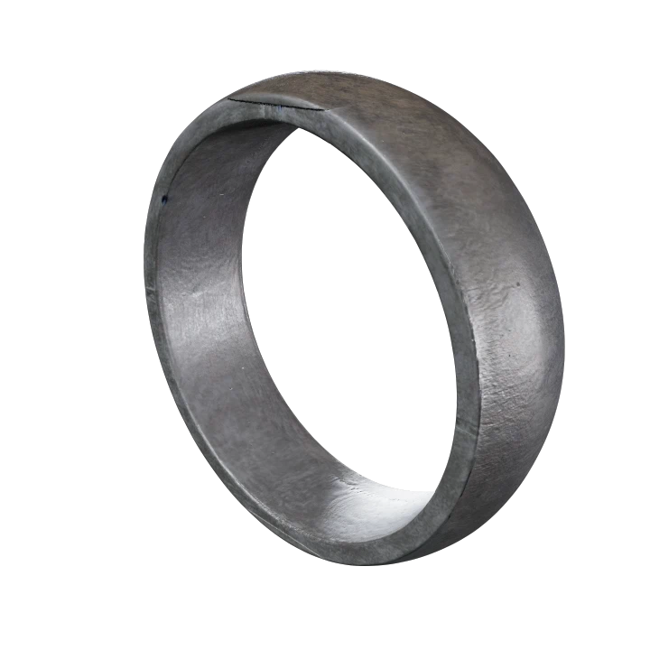
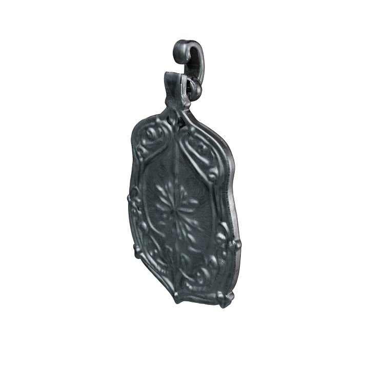

# Jewelry Design Generator

Create stunning 3D jewelry designs with AI. This tool builds detailed models of rings, chains, bracelets and more in gold, silver, platinum, and other materials.

## Tech Stack

Built with:

- **Python 3.10+**: Core language
- **[Meshy AI](https://docs.meshy.ai)**: 3D model generation
- **[uv](https://github.com/astral-sh/uv)**: Ultra-fast Python package manager (10-100x faster than pip/Poetry)
- **Asyncio**: Speeds up batch generation with concurrent API calls
- **Logging**: Tracks progress during generation

## Features

- Create 3D models of rings, chains, bracelets, necklaces, earrings, and pendants
- Choose from gold, silver, platinum, rose gold, or other metals
- Design different chain styles (cuban, figaro, rope, etc.) with smooth edges
- Generate multiple designs simultaneously for production runs
- Download in GLB, FBX, OBJ or USDZ formats
- Get PBR textures for realistic renders

## Example Outputs

Here are some stunning designs created with this tool:

### Classic Silver Ring


### Silver Pendant


## Quick Start

```bash
# Clone the repo
git clone https://github.com/ahmifte/python-jewelry-design-gen.git
cd python-jewelry-design-gen

# Install with uv (blazing fast!)
curl -fsSL https://astral.sh/uv/install.sh | bash  # if you don't have uv yet
uv venv
source .venv/bin/activate  # On Windows: .venv\Scripts\activate
uv pip install -e ".[dev]"

# Add your Meshy API key
echo "MESHY_API_KEY=your_api_key_here" > .env

# Create your first design!
python main.py generate --material silver --type ring
```

> **Note**: We've switched from Poetry to uv for package management because it's 10-100x faster! See the [uv workflow guide](docs/uv_workflow.md) for details.

## Documentation

Need more details? Check out:

- [Installation guide](docs/installation.md)
- [Configuration options](docs/configuration.md)
- [Usage guide](docs/usage.md)
- [Workflow examples](docs/workflow.md)
- [Example outputs](docs/examples.md)
- [Testing](docs/testing.md)
- [uv development workflow](docs/uv_workflow.md)

## Testing

Run tests with our test script:

```bash
# Run all tests
./scripts/run_tests.py

# Run tests with a sample batch
./scripts/run_tests.py --run-batch

# Diagnose test and coverage issues
./scripts/diagnose_tests.py
```

Note: When running coverage manually, use the correct module path:

```bash
# Correct coverage path for the module
python -m pytest --cov=src.python_jewelry_design_gen

# For CI/CD workflows, include XML report
python -m pytest --cov=src.python_jewelry_design_gen --cov-report=xml
```

## Meshy Integration

This tool uses [Meshy AI](https://docs.meshy.ai) for text-to-3D generation with jewelry-optimized prompts that deliver:

- High-quality 3D models from text descriptions
- Multiple export formats
- PBR materials with realistic metal properties
- Extensive customization options

## License

MIT
