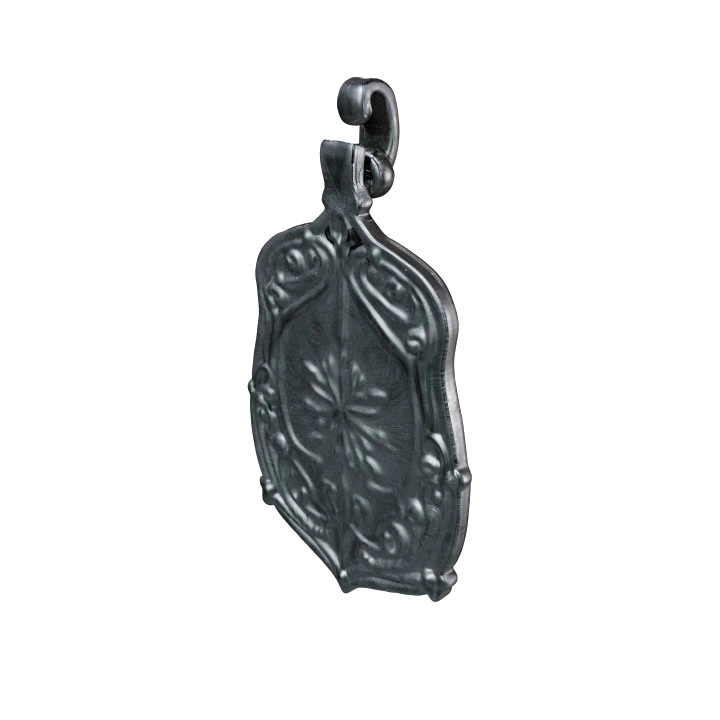

# Example Outputs

Check out these sample silver jewelry pieces the tool generated:

## 1. Classic Silver Ring

A sleek, simple silver ring with that classic polished look:


Made with:
```bash
python main.py generate --material silver --type ring --open-browser
```

## 2. Silver Pendant

Love this ornate silver pendant - perfect for a necklace:



Made with:
```bash
python main.py generate --material silver --type pendant --open-browser
```

## Output Formats

The tool gives you files in different formats for whatever you need:

- **GLB/GLTF**: Great for web display and 3D viewers
- **FBX**: For animation software and game engines
- **OBJ/MTL**: Classic format with material data
- **USDZ**: For AR on iPhones and iPads
- **STL**: Ready for 3D printing

Each model comes with:
- PBR texture maps (color, metallic, roughness, normal)
- Proper UV coordinates
- Smooth topology
- Realistic metal properties 